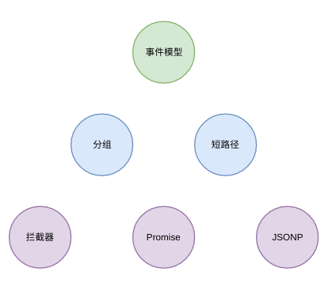
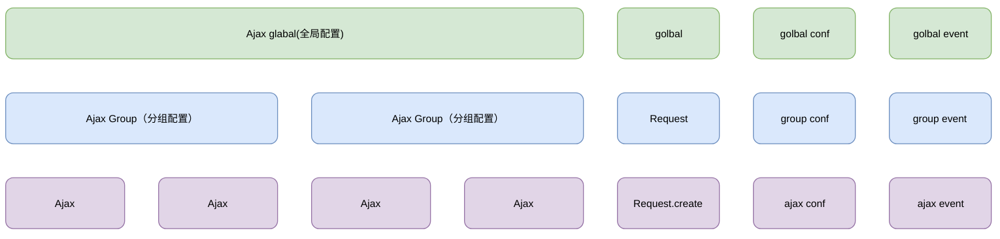
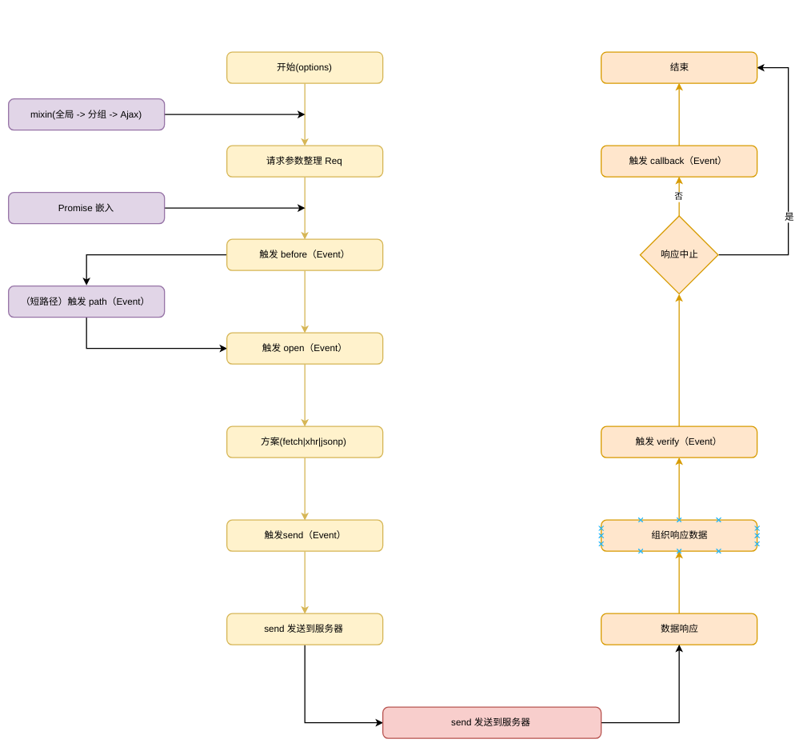
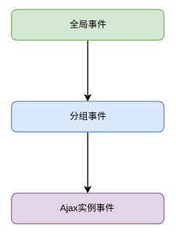

# Ajax

> 一套支持分组拦截器的 ajax

## 特点

-   事件模型驱动；
-   ajax 分组支持；
-   基于事件模型的拦截器，支持分组拦截器；
-   支持 promise；
-   灵活的默认配置，全局->分组->ajax；
-   短路径支持，方便统一切换接口路径；
-   提供实时获取服务器时间方法；
-   jsonp 和 fetch 支持。



## 安装

> npm install rimjs -- save

## 使用

> import request from "rimjs/ajax"

## 三层结构



## 流程图



## 事件说明

| 事件名称 | 说明                                     | 参数  |
| -------- | ---------------------------------------- | ----- |
| timeout  | 请求超时                                 | req   |
| callback | 请求完成                                 | res   |
| abort    | 请求中止                                 | req   |
| verify   | 验证数据                                 | res   |
| send     | 请求发送                                 | req   |
| progress | 上传进度                                 | event |
| open     | send 之前，对传入的数据已经格式化完成    | req   |
| before   | 最先触发的事件，req 中保存的数据相对原始 | req   |
| path     | 对 url 格式化后触发                      |

> req.dataType 只有在 before 中能修改
> req.isFormData 在 before 中无此属性

## 事件流程



## 新建一个分组

```js
let group = new ajax.Group()
```

## 添加事件拦截器

> 事件作用在一个分组上或者作用在单个请求上

```javascript
// 这个事件作用在分组上
group.on("open", {req} => {
    // 这个事件可以看做一个请求拦截器
})

group
    .load("<post>url", {res} => {
        // 这里的回调相当于ajaxOne.on("callback", res => {})

    })
    .on("open", {req} => {
        // 这个事件仅作用与当前请求，并且上面那个拦截器后触发
    })

// 更多参数设置，直接通过 setConf 来设置
// 默认请求使用 get
group
    .load("url", {res} => {})
    .setConf({
        type: "json"
    })
```

## promise 支持

```javascript
// 此时全局拦截器仍然有效
group
    .fetch({
        url
    })
    .then(res => {
        // 当res.err 为 null
    })
    .catch(res => {
        // 当res.err 为 非null
    })

// or

group.load("url", param).then()
```

## 全局参数设置

```javascript
ajax.global.setConf({
    // 默认使用 fetch请求
    useFetch: true,
    // 返回资源类型为 json
    resType: "json",
    // jsonp的key为 callback
    jsonpKey: "callback"
})
```

## 短路径设置

```javascript
group.setConf({
    paths: {
        // 设置短路径
        webapi: "/data/api/"
    }
})

// 使用短路径
// webapi: 被替换为　/data/api/
group.get("webapi:getuser.html", res => {}, { token: "----" })
```

## 服务器时间自动获取

```javascript
// 这里返回服务器事件
group.getDate()
// 或者
group.load(
    "webapi:getuser.html",
    {getDate} => {
        // 这里返回服务器事件
        getDate()
    },
    { token: "----" }
)
```

## options 支持参数说明

| 名称            | 说明                                          | 默认值      |
| --------------- | --------------------------------------------- | ----------- |
| baseURL         | 基础 url 路径                                 | 空字符串    |
| paths           | 短路径(替换 url 中的短路径)                   | 空对象      |
| useFetch        | 是否使用 fetch,如果浏览器不支持，则降级为 xhr | true        |
| url             | 请求 url，支持短路径                          | 空字符串    |
| method          | 请求方法                                      | GET         |
| dataType        | 请求数据格式                                  | querystring |
| resType         | 返回数据格式                                  | json        |
| param           | 请求参数                                      | null        |
| header          | 请求头设置                                    | null        |
| jsonpKey        | jsonp 请求是需要的 key                        | callback    |
| cache           | get 请求是否有缓存                            | true        |
| withCredentials | 跨域带上 cookie                               | false       |

## 事件参数 course

| 名称     | 说明                        | 默认值     |
| -------- | --------------------------- | ---------- |
| req      | 请求时的一些参数（见下表）  | {}         |
| res      | 请求返回时参数 （见下下表） | {}         |
| progress | ProgressEvent 上传进度      | null       |
| getDate  | 获取服务器时间              | 客户端时间 |

## 事件参数 req 说明

| 名称            | 说明                                  | 默认值                                          |
| --------------- | ------------------------------------- | ----------------------------------------------- |
| outFlag         | ajax 已经中止，内部使用               | false                                           |
| method          | 请求方法                              | GET                                             |
| url             | 请求 url                              | 空字符串                                        |
| originURL        | 保存的是原始传入的 url                | url                                             |
| formatURL       | 格式化后（最终使用的）的 url          | 短路径 -> 全路径                                |
| path            | 短路径目录截取值                      | 短路径 url 开头处 : 前面的字符，默认为 空字符串 |
| cache           | get 请求是否有缓存                    | true                                            |
| resType         | 请求类型                              | 空字符串，默认为 querystring                    |
| isFormData      | 是否为 FormData 数据，针对非 GET 请求 | 按照 param 类型数据自动判定                     |
| param           | 请求参数                              | 空对象                                          |
| header          | 请求头                                | 空对象                                          |
| baseURL         | 基础 url 路径                         | 空字符串                                        |
| isCross         | 是否跨域                              | 按照 url 路径自动判断                           |
| xhr             | xhr 请求的对象                        |                                                 |
| withCredentials | 跨域带上 cookie                       | false                                           |

## 事件参数 res 说明

| 名称           | 说明                          | 默认值                    |
| -------------- | ----------------------------- | ------------------------- |
| withReq        | req 的引用                    | req                       |
| root           | this 引用                     | Ajax                      |
| err            | 错误内容                      | 默认为 null，便是正确返回 |
| json           | json object                   | 空对象                    |
| text           | 获取到的字符串                | 空字符串                  |
| result         | 返回内容                      |                           |
| getHeader(key) | 获取 key 对应的 header        | null                      |
| cancel         | 验证节点设置为 true，中止回调 | false                     |
| status         | 状态吗                        | 0                         |
| getDate()      | 获取服务器时间                |                           |
| getJSON(key)   | 获取 res.json 中的子字符串    |                           |
| jsonKey        | jsonKey 中的对象              | json                      |

-   设置全局参数，作用于全局的默认参数

## AjaxGroup 原型方法

> setConf(options)

-   当前分组实例的默认参数

> create(options):Ajax

-   当前分组下创建一个 ajax 请求
-   options 只作用于当前 ajax 请求
-   返回当前 Ajax 的实例

> fetch(options)

-   当前分组下创建一个 ajax 请求，返回 Promise 对象

> setDate(date:Date)

-   设置服务器时间，一般内部使用

> getDate():Date

-   获取服务器时间

> load(url[, callback, param]):Ajax
> load(url[, param]):Ajax

-   快捷方式加载

## Ajax 原型方法

> constructor(group[, options])

-   构造方法
-   group 为属于的分组
-   options 为预设的参数

> setConf(options)

-   仅作用于当前 ajax 请求的参数

> abort()

-   中止当前 Ajax 请求

> timeout(ms[, callback])

-   超时中止

> send(param, isOver)

-   发送请求
-   param 请求参数
-   isOver， 如果当此 ajax 正在请求是，是否中止 默认 false，为新发送的请求丢失

> then([resolve:function])

-   返回 Promise 对象

> emit(type, ...args)

-   触发事件
-   type 事件名称
-   args 事件参数

> emit(type)

-   判断是否有此事件

> on(type, eventcall)

-   添加事件
-   type 事件名称
-   eventcall 事件函数

> off(type[, eventcall])

-   移除事件
-   type 事件名称
-   eventcall 事件函数
-   eventcall 不存在的时候，移除 type 对用的所有事件(不包含继承事件)

## 全局设置

`global.setConf(options)` 配置全局默认参数
`global.on(type, callback)` 配置全局的事件
`global.off(type)` 销毁全局的事件
