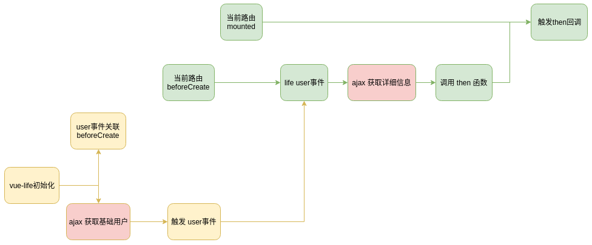

# rimjs/vueLife

## Vue 自定义生命周期

-   所有自定义生命周期，都绑定 Vue 的实际生命周期函数，并确保在实际生命周期之后执行
-   自定义生命周期函数的运行受限于本身项目中的特定流程。
-   下面实例

## 示例

```javascript
// 初始化 钩子函数 ready
import VueLife from "rimjs/vueLife"
Vue.use(VueLife, {
    // 完成回调
    init({ emit, vue, hooks }, ...args) {
        // 此处的emit是全局触发
        // 初始化内设置 绑定vue生命周期函数
        hooks.before = "beforeCreate"
        // 运行获取完成身份触发的事件
        setTimeout(() => {
            emit("user", { account: "account" })
        }, 500)

        setTimeout(() => {
            emit("ready", "app is ready")
        }, 200)

        setTimeout(() => {
            emit("before", "app is before")
        }, 0)
    },
    // 默认绑定的vue本身生命周期函数
    hookDef: "mounted",
    // 设置特定的生命周期函数绑定
    hooks: {
        user: "created"
    },
    // 运行 init 函数时赋予的额外参数
    args: []
})
```

```javascript
// vue中，实际触发
{
    life: {
        befor ({data, then, emit}) {
            // emit 可以触发其他的事件，此事件只局限于本组件中
            // 此处触发大概在 beforeCreate 左右
            // 此处可以利用vue生命周期的间隔来初始化数据
            then(() => {
                // 此处触发，会在 hookDef(mounted) 设置的触发时机触发
            })
        },
        user ({data}) {
            // 这个生命周期将在 emit("user", {account: "account"}) 和 created 之后来触发生命周期（hooks配置）
            // data 内容为 {account: "account"}
        },
        ready ({data}) {
            // 这个生命周期将在 emit("ready", "app is ready") 和 mounted 之后来触发生命周期（hookDef配置）
            // data 内容为 "app is ready"
        }
    }
}

```

## 实例

> 下面两个 ajax 触发时间都可以发生在 vue 本省生命周期函数过度期间运行，加快页面加载速度

### 流程图



### 初始化

```js
import VueLife from "rimjs/vueLife"
Vue.use(VueLife, {
    // 完成回调
    init({ emit, hooks }) {
        // user 事件关联 hooks.before = "beforeCreate"
        hooks.user = "beforeCreate"

        // ajax获取用户信息
        ajax(function(res) {
            // user 事件触发
            emit("user", res)
        })
    }
})
```

### vue 实例

```html
<script>
    export default {
        life: {
            user({ then, data }) {
                /*
                    这里的会在 beforeCreate 之后触发
                    由于首次加载，可能由于ajax原因，会延后触发
                    data 即为 上面的 ajax回调参数 res
                */

                // ajax加载用用户详细信息
                ajax(function(userDetail) {
                    // 加载完成后，用then函数
                    then(function() {
                        // 这里的代码能保证在 mounted 之后触发
                        // ...
                    })
                })
            }
        }
    }
</script>
```

### prepose 自定在 beforeCreate 时会触发

```html
<script>
    export default {
        life: {
            prepose({ then, emit }) {
                /*
                    这里的会在 beforeCreate 之后触发
                    emit 可以手动出发其他自定义事件，但仅限于当前实例
                */

                // 这里表示异步执行
                setTimeout(function(userDetail) {
                    // 使用then函数回调保证回调在 mounted 之后处罚
                    then(function() {
                        // 这里的代码能保证在 mounted 之后触发
                        // ...
                    })
                }, 0)
            }
        }
    }
</script>
```
